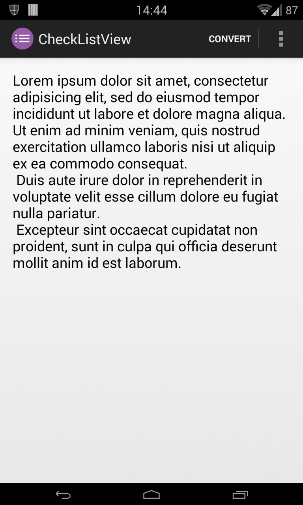
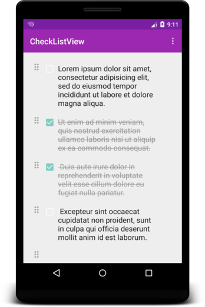
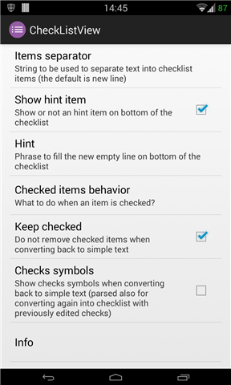

[](https://jitpack.io/#federicoiosue/CheckListView/3.0.2)

CheckListView
=============

Library to convert an EditText into a View capable of acting as checklist

  


Try out the app on the [Play Store](https://play.google.com/store/apps/details?id=it.feio.android.checklistview.demo).


##Usage

```java
private void toggleCheckList() {
    View newView;

    /*
     * Here is where the job is done. By simply calling an instance of the
     * ChecklistManager we can call its methods.
     */
    try {
        // Getting instance
        ChecklistManager mChecklistManager = ChecklistManager
            .getInstance(mActivity);

        /* 
         * These method are useful when converting from EditText to ChecklistView
         * (but can be set anytime, they'll be used at appropriate moment)
         */

        // Setting new entries hint text (if not set no hint
        // will be used)
        mChecklistManager.setNewEntryHint(prefs.getString("settings_hint", ""));
        // Let checked items are moved on bottom
        mChecklistManager.setMoveCheckedOnBottom(Integer.valueOf(prefs.getString(
            "settings_checked_items_behavior", "0")));


        /* 
         * These method are useful when converting from ChecklistView to EditText 
         * (but can be set anytime, they'll be used at appropriate moment)
         */

        // Decide if keep or remove checked items when converting 
        // back to simple text from checklist
        mChecklistManager.setKeepChecked(prefs.getBoolean("settings_keep_checked", true));
        // I want to make checks symbols visible when converting 
        // back to simple text from checklist
        mChecklistManager.setShowChecks(prefs.getBoolean("settings_show_checks", false));

        // Converting actual EditText into a View that can
        // replace the source or viceversa
        newView = mChecklistManager.convert(switchView);
        // Replacing view in the layout
        mChecklistManager.replaceViews(switchView, newView);
        // Updating the instance of the pointed view for
        // eventual reverse conversion
        switchView = newView;
    } catch (ViewNotSupportedException e) {
        // This exception is fired if the source view class is
        // not supported
        e.printStackTrace();
    }
}
```

##How to include

In your app's module *gradle.build* file add the following compile inclusion:

```compile 'com.github.federicoiosue:CheckListView:3.0.2'```

##Dependencies

There are no dependencies for the library, but if you want to compile the demo project you'll need to add [AppCompat](http://developer.android.com/tools/support-library/features.html) as library too


##Developed By

* Federico Iosue - <federico.iosue@gmail.com>


##License

    Copyright 2015 Federico Iosue

    Licensed under the Apache License, Version 2.0 (the "License");
    you may not use this file except in compliance with the License.
    You may obtain a copy of the License at

       http://www.apache.org/licenses/LICENSE-2.0

    Unless required by applicable law or agreed to in writing, software
    distributed under the License is distributed on an "AS IS" BASIS,
    WITHOUT WARRANTIES OR CONDITIONS OF ANY KIND, either express or implied.
    See the License for the specific language governing permissions and
    limitations under the License.
    
    
    
